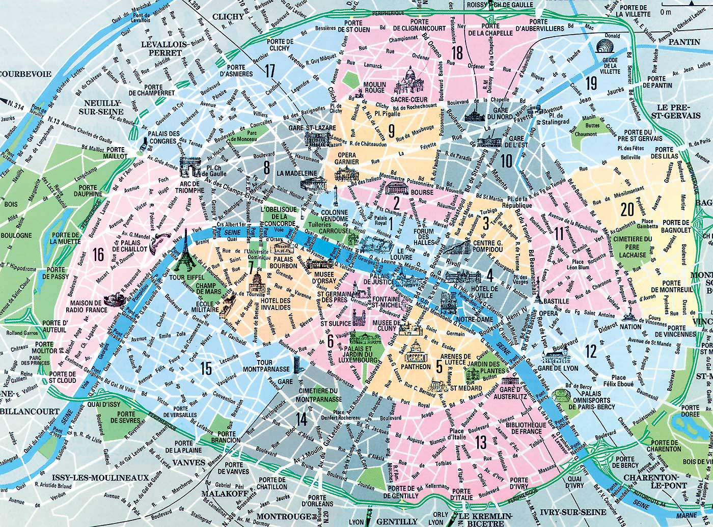

# Recherche appartement Paris

| [Cibles](#cibles) | [Dossier](#dossier) | [Pistes](#pistes) |
|-------------------|---------------------|-------------------|

# Cibles

| Sources                                                                                                                                                                                                                                                                                                                                                                                                                                                                                                                                                                                                                 | Critères Non-négociables                       | Critères Négociables |
| ---------                                                                                                                                                                                                                                                                                                                                                                                                                                                                                                                                                                                                               | -----------------                              | ---------------      |
| [pap](https://www.pap.fr/annonce/locations-appartement-ascenseur-vide-paris-75-g439-studio-jusqu-a-900-euros)                                                                                                                                                                                                                                                                                                                                                                                                                                                                                                           | ascenceur                                      | Studio/T2/...        |
| [seloger.com](https://www.seloger.com/map.htm?types=1&projects=1&enterprise=0&lift=1&furnished=0&kitchen=9&price=450%2F900&rooms=1&places=%5B%7Bci%3A750056%7D%7C%7Bci%3A750101%7D%7C%7Bci%3A750102%7D%7C%7Bci%3A750103%7D%7C%7Bci%3A750104%7D%7C%7Bci%3A750105%7D%7C%7Bci%3A750106%7D%7C%7Bci%3A750107%7D%7C%7Bci%3A750108%7D%7C%7Bci%3A750109%7D%7C%7Bci%3A750110%7D%7C%7Bci%3A750111%7D%7C%7Bci%3A750112%7D%7C%7Bci%3A750113%7D%7C%7Bci%3A750114%7D%7C%7Bci%3A750115%7D%7C%7Bci%3A750116%7D%7C%7Bci%3A750117%7D%7C%7Bci%3A750118%7D%7C%7Bci%3A750119%7D%7C%7Bci%3A750120%7D%5D&mandatorycommodities=1&qsVersion=1.0) | sommeil tranquille: bruit/vibrations/voisinage |                      |
| [bien d'ici](https://www.bienici.com/recherche/location/paris-75000/2-pieces-et-plus?prix-max=900&chambres-min=1 )                                                                                                                                                                                                                                                                                                                                                                                                                                                                                                      | quartier donnant envie de sortir               |                      |
| [leboncoin](https://www.leboncoin.fr/recherche/?category=10&locations=Paris__48.85790400439862_2.358842071208555_10000_5000&real_estate_type=2&furnished=2&price=400-900&rooms=min-2)                                                                                                                                                                                                                                                                                                                                                                                                                                               | direct Gare Montparnasse (Metros 4/6/12/13)    |                      |
|                                                                                                                                                                                                                                                                                                                                                                                                                                                                                                                                                                                                                         | fibre                                          |                      |

## Dossier

| Moi   | KH           | DM         | une pièce justificative d'identité en cours de validité, comportant la photographie du titulaire                                                                                                                                                                                                                                                                                       |
| ----- | ------------ | ---------- | --------------------------------------------------------------------------------------------------                                                                                                                                                                                                                                                                                     |
| ✓     |              |            | Carte nationale d'identité française ou étrangère                                                                                                                                                                                                                                                                                                                                      |
|       |              |            | Passeport français ou étranger                                                                                                                                                                                                                                                                                                                                                         |
|       |              |            | Permis de conduire français ou étranger                                                                                                                                                                                                                                                                                                                                                |
| --    | --           | --         | **une pièce justificative d'identité en cours de validité, comportant la photographie du titulaire Une seule pièce justificative de domicile**                                                                                                                                                                                                                                         |
|       |              |            | Dernière quittance de loyer.                                                                                                                                                                                                                                                                                                                                                           |
| ✓     |              |            | Facture d'eau, de gaz ou d'électricité de moins de trois mois.                                                                                                                                                                                                                                                                                                                         |
|       |              |            | Attestation d'assurance logement de moins de trois mois.                                                                                                                                                                                                                                                                                                                               |
|       |              |            | Dernier avis de taxe foncière ou, à défaut, titre de propriété de la résidence principale.                                                                                                                                                                                                                                                                                             |
| --    | --           | --         | **Un ou plusieurs documents attestant des activités professionnelles**                                                                                                                                                                                                                                                                                                                 |
| ✓     |              |            | Contrat de travail ou de stage ou, à défaut, une attestation de l'employeur précisant l'emploi et la rémunération proposée, la date d'entrée en fonctions envisagée et le cas échéant la durée de la période d'essai.                                                                                                                                                                  |
|       |              |            | L'extrait K ou K bis du registre du commerce et des sociétés datant de moins de trois mois pour une entreprise commerciale.                                                                                                                                                                                                                                                            |
|       |              |            | L'extrait D 1 original du registre des métiers de moins de trois mois pour un artisan.                                                                                                                                                                                                                                                                                                 |
|       |              |            | La copie du certificat d'identification de l'INSEE, comportant les numéros d'identification, pour un travailleur indépendant.                                                                                                                                                                                                                                                          |
|       |              |            | La copie de la carte professionnelle pour une profession libérale.                                                                                                                                                                                                                                                                                                                     |
|       |              |            | Toute pièce récente attestant de l'activité pour les autres professionnels.                                                                                                                                                                                                                                                                                                            |
| --    | --           | --         | **Un ou plusieurs documents attestant des ressources**                                                                                                                                                                                                                                                                                                                                 |
|       |              |            | Dernier avis d'imposition ou de non-imposition et, lorsque tout ou partie des revenus perçus n'a pas été imposé en France mais dans un autre Etat ou territoire, le dernier avis d'imposition à l'impôt ou aux impôts qui tiennent lieu d'impôt sur le revenu dans cet Etat ou territoire ou un document en tenant lieu établi par l'administration fiscale de cet Etat ou territoire. |
|       |              |            | Titre de propriété d'un bien immobilier ou dernier avis de taxe foncière.                                                                                                                                                                                                                                                                                                              |
|       |              |            | Trois derniers bulletins de salaires.                                                                                                                                                                                                                                                                                                                                                  |
|       |              |            | Les deux derniers bilans ou, à défaut, une attestation de ressources pour l'exercice en cours délivré par un comptable pour les professions non salariées.                                                                                                                                                                                                                             |
| ✓     |              |            | Justificatif de versement des indemnités, retraites, pensions, prestations sociales et familiales et allocations perçues lors des trois derniers mois ou justificatif de l'ouverture des droits, établis par l'organisme payeur.                                                                                                                                                       |
|       |              |            | Justificatif de revenus fonciers, de rentes viagères ou de revenus de valeurs et capitaux mobiliers.                                                                                                                                                                                                                                                                                   |

## Pistes
|Lien|Recap|
|----|-----|
|[pap](https://www.pap.fr/annonces/appartement-paris-r192210534)|20e, 25m (Métro 3bis Pelleport)|
|[se loger](https://www.seloger.com/annonces/locations/appartement/paris-11eme-75/republique-saint-ambroise/163490135.htm?types=1&projects=1&enterprise=0&lift=1&furnished=0&kitchen=9&price=450%2F900&rooms=1&places=%5B%7Bci%3A750056%7D%7C%7Bci%3A750101%7D%7C%7Bci%3A750102%7D%7C%7Bci%3A750103%7D%7C%7Bci%3A750104%7D%7C%7Bci%3A750105%7D%7C%7Bci%3A750106%7D%7C%7Bci%3A750107%7D%7C%7Bci%3A750108%7D%7C%7Bci%3A750109%7D%7C%7Bci%3A750110%7D%7C%7Bci%3A750111%7D%7C%7Bci%3A750112%7D%7C%7Bci%3A750113%7D%7C%7Bci%3A750114%7D%7C%7Bci%3A750115%7D%7C%7Bci%3A750116%7D%7C%7Bci%3A750117%7D%7C%7Bci%3A750118%7D%7C%7Bci%3A750119%7D%7C%7Bci%3A750120%7D%5D&mandatorycommodities=1&qsVersion=1.0&BD=Carto_Detail_Cartouche&ref=map)|11e, 28m (Métro Richard-Lenoir)|
|[se loger](https://www.seloger.com/annonces/locations/appartement/paris-13eme-75/buttes-aux-cailles-glaciere/164412149.htm?types=1&projects=1&enterprise=0&lift=1&furnished=0&kitchen=9&price=450%2F900&rooms=1&places=%5B%7Bci%3A750056%7D%7C%7Bci%3A750101%7D%7C%7Bci%3A750102%7D%7C%7Bci%3A750103%7D%7C%7Bci%3A750104%7D%7C%7Bci%3A750105%7D%7C%7Bci%3A750106%7D%7C%7Bci%3A750107%7D%7C%7Bci%3A750108%7D%7C%7Bci%3A750109%7D%7C%7Bci%3A750110%7D%7C%7Bci%3A750111%7D%7C%7Bci%3A750112%7D%7C%7Bci%3A750113%7D%7C%7Bci%3A750114%7D%7C%7Bci%3A750115%7D%7C%7Bci%3A750116%7D%7C%7Bci%3A750117%7D%7C%7Bci%3A750118%7D%7C%7Bci%3A750119%7D%7C%7Bci%3A750120%7D%5D&mandatorycommodities=1&qsVersion=1.0&BD=Carto_Detail_Cartouche&ref=map)|13e, 25m (Métro Corvisart)|
|[se loger](https://www.seloger.com/annonces/locations/appartement/paris-13eme-75/bievres-sud-tolbiac/164035397.htm?types=1&projects=1&enterprise=0&lift=1&furnished=0&kitchen=9&price=450%2F900&rooms=1&places=%5B%7Bci%3A750056%7D%7C%7Bci%3A750101%7D%7C%7Bci%3A750102%7D%7C%7Bci%3A750103%7D%7C%7Bci%3A750104%7D%7C%7Bci%3A750105%7D%7C%7Bci%3A750106%7D%7C%7Bci%3A750107%7D%7C%7Bci%3A750108%7D%7C%7Bci%3A750109%7D%7C%7Bci%3A750110%7D%7C%7Bci%3A750111%7D%7C%7Bci%3A750112%7D%7C%7Bci%3A750113%7D%7C%7Bci%3A750114%7D%7C%7Bci%3A750115%7D%7C%7Bci%3A750116%7D%7C%7Bci%3A750117%7D%7C%7Bci%3A750118%7D%7C%7Bci%3A750119%7D%7C%7Bci%3A750120%7D%5D&mandatorycommodities=1&qsVersion=1.0&BD=Carto_Detail_Cartouche&ref=map)|13e, 25m (RER Cité Universitaire)|
|[se loger](https://www.seloger.com/annonces/locations/appartement/paris-14eme-75/raspail-montparnasse/164328781.htm?types=1&projects=1&enterprise=0&lift=1&furnished=0&kitchen=9&price=450%2F900&rooms=1&places=%5B%7Bci%3A750056%7D%7C%7Bci%3A750101%7D%7C%7Bci%3A750102%7D%7C%7Bci%3A750103%7D%7C%7Bci%3A750104%7D%7C%7Bci%3A750105%7D%7C%7Bci%3A750106%7D%7C%7Bci%3A750107%7D%7C%7Bci%3A750108%7D%7C%7Bci%3A750109%7D%7C%7Bci%3A750110%7D%7C%7Bci%3A750111%7D%7C%7Bci%3A750112%7D%7C%7Bci%3A750113%7D%7C%7Bci%3A750114%7D%7C%7Bci%3A750115%7D%7C%7Bci%3A750116%7D%7C%7Bci%3A750117%7D%7C%7Bci%3A750118%7D%7C%7Bci%3A750119%7D%7C%7Bci%3A750120%7D%5D&mandatorycommodities=1&qsVersion=1.0&BD=Carto_Detail_Cartouche&ref=map)|14e, 31m (Montparnasse)|

## Message
Bonjour,

Ingénieur informatique ayant 4 ans d'expérience,  j'ai 28 ans et vis seul. Je me remets à la vie active après une année sabbatique et ai dans les mains un contrat de travail signé pour un CDI dans une société de service démarrant au plus tard mi-Novembre (recrutement  sur profil).

Mon salaire brut minimal, sans tenir compte de la rémunération liée à mes missions, sera de 55k brut annuel et j'ai deux garants à ma disposition.

Votre studio m'intéresse grandement et j'ai grand espoir de vous convaincre de ma capacité à garantir une sérénité concernant le paiement du loyer, mais également concernant la préservation de sa valeur au travers de la stabilité de mon domaine de travail et mon mode de vie minimaliste.

Je me mets à votre disposition dans ce but, et suis prêt à vous faire parvenir une version électronique des pièces demandées au plus tôt.
